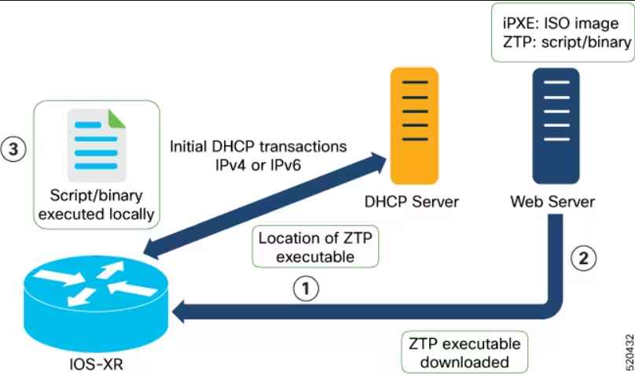
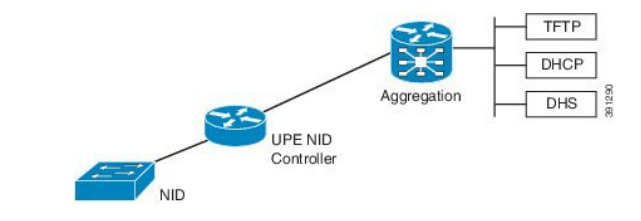
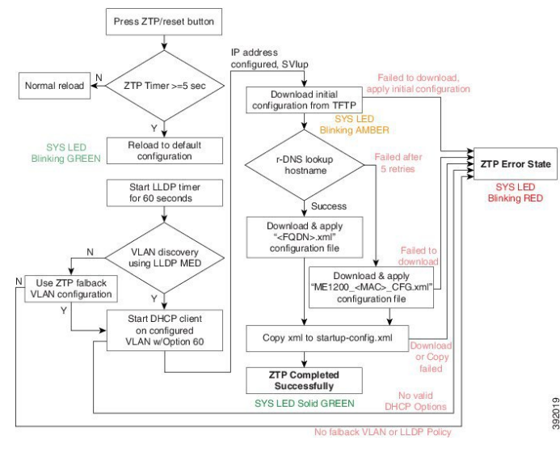

# Utilisation des routeurs Cisco 7200 avec GNS3 et ZTP

## Introduction

Dans ce guide, nous allons explorer comment utiliser les routeurs Cisco 7200 avec GNS3 et Zero Touch Provisioning (ZTP) pour configurer automatiquement les routeurs connectés au client sur le backbone d'un opérateur.

## Prérequis

Avant de commencer, assurez-vous d'avoir les éléments suivants :

- GNS3 installé sur votre machine
- Images du routeur Cisco 7200 pour GNS3
- Une compréhension de base des concepts de réseau et de la configuration des routeurs Cisco.

## Configuration de GNS3

1. Installez GNS3 sur votre machine en suivant la documentation officielle.
2. Téléchargez les images des routeurs Cisco 7200 compatibles avec GNS3.
3. Importez les images du routeur dans GNS3.
4. Configurez les interfaces réseau et les connexions nécessaires dans GNS3 pour simuler la topologie réseau souhaitée.

## Configuration de ZTP

1. Activez ZTP sur les routeurs Cisco 7200 en configurant les paramètres nécessaires dans la configuration du routeur.

   1. Pour le port vers les serveurs tftp dhcp:
      1. Router(config)# interface Gigabit 1/1
      2. Router(config)# lldp med-tvl-select network-policy
      3. Router(config)# lldp transmit
      4. Router(config)# lldp receive
      5. Router(config)# exit
      6. Router(config)# lldp run

   2. Pour les ports connectés aux autres routeur de la backbone:
      1. Router(config)# interface Gigabit 1/2
      2. Router(config)# switchport mode trunk
      3. Router(config)# lldp med media-vlan policy-list 1  -> Assigning media VLAN policy
      4. Router(config)# lldp med type connectivity   -> Configuring NID1 as network device
      5. Router(config)# no spanning-tree
      6. Router(config)# lldp transmit    -> LLDP transmission is enabled
      7. Router(config)# lldp receive     -> LLDP reception is enabled
   3. Sur l'équipement en face du port précédent:
      1. Router(config)# lldp med media-vlan-policy 1 voice tagged 10 l2-priority 0 dscp 0

2. Configurez un serveur ZTP sur votre réseau pour fournir les fichiers de configuration aux routeurs.

3. Créez les fichiers de configuration pour chaque routeur, en spécifiant les paramètres de configuration souhaités.

4. Configurez le serveur DHCP sur le serveur ZTP pour qu'il fournisse des adresses IP aux routeurs et spécifiez l'adresse IP du serveur ZTP en tant qu'option du serveur suivant.
   1. Configurez le pool DHCP. Dans cet exemple, nous créons un pool nommé "ZTPPOOL" :
      1. Router(config)# ip dhcp pool ZTPPOOL

   2. Configurez la plage d'adresses IP à distribuer. Dans cet exemple, nous configurons une plage de 192.0.2.10 à 192.0.2.50 :
      1. Router(dhcp-config)# network 192.0.2.0 255.255.255.0

   3. Configurez l'adresse du serveur TFTP où les fichiers de configuration sont stockés. Dans cet exemple, nous utilisons l'adresse 192.0.2.1 :
      1. Router(dhcp-config)# default-router 192.0.2.1

   4. Configurez l'option 150 pour spécifier l'adresse du serveur TFTP. Dans cet exemple, nous utilisons l'adresse 192.0.2.1 :
      1. Router(dhcp-config)# option 150 ip 192.0.2.1

5. Connectez les routeurs au réseau et mettez-les sous tension.

## Vérification de la configuration ZTP

1. Surveillez les journaux du serveur ZTP pour vous assurer que les routeurs demandent des fichiers de configuration.
   1. sudo tail -f /var/log/syslog | grep dhcpd
   2. sudo tail -f /var/log/syslog | grep tftpd

2. Vérifiez que les routeurs reçoivent les fichiers de configuration et appliquent les configurations automatiquement.
3. Tester la connectivité entre les routeurs et le client sur le backbone de l'opérateur pour s'assurer de la réussite de la configuration.

## Conclusion

En utilisant les routeurs Cisco 7200 avec GNS3 et ZTP, vous pouvez automatiser le processus de configuration des routeurs connectés au client sur le backbone de l'opérateur. Cela facilite le déploiement et la gestion de l'infrastructure réseau.
